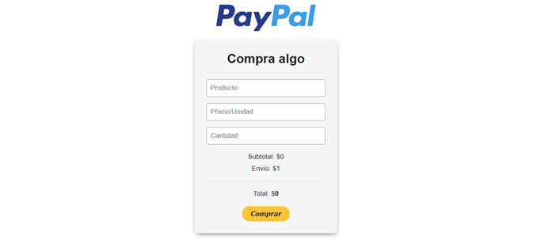

# PayPalPrueba

Usando el API de PayPal para hacer movimientos.

-----------------------

## API REST usado

[PayPal SDK para PHP](https://paypal.github.io/PayPal-PHP-SDK/)

## Como funciona

## Instrucciones
Hasta ahora lo que se puede hacer con el programa es:
- Escribir un solo producto, precio unitario y cantidad.

- Redireccionarte al checkout de PayPal.
- Iniciar sesion con tu cuenta de PayPal.
    > Se supone que PayPal por defecto te deja pagar como invitado sin iniciar sesion, "aveces" en el checkout aparece el boton ese.
- Verificar el carrito que te muestra PayPal y pagar.

- Ya que se carga el pago se agrega a una base de datos
    > **Ojo:** la base de datos debe estar ya creada con todo y tabla.
- Mostrar la informacion

- Emitir un webhook para notificar cualquier movimiento (tarda un tiempo)
    > Hay que tener configurado el link hacia donde va el webhook